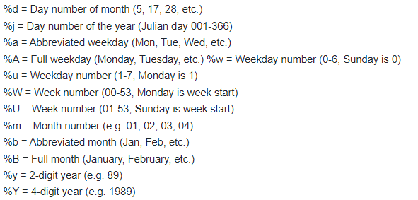

<!-- README.md is generated from README.Rmd. Please edit that file -->

# LTASR

<!-- badges: start -->
<!-- badges: end -->

This package provides functions to replicate the CDC’s LTAS program
within R. Currently, it will only stratify a cohort for fixed strata. It
does not consider a history file for time-dependent exposures/variables.

It comes pre-installed with referent underlying cause of death (UCOD)
rates for the 119 minors defined at
<https://www.cdc.gov/niosh/ltas/pdf/Rate-Info-Table-1.pdf> for the US
population from 1960 to 2020.

## Installation

You can install LTASR like so:

``` r
install.packages('LTASR')
```

## Example

*It is highly recommended to use R as well as RStudio. RStudio is a
separate piece of software used to write and run R code.*

1.  It is highly recommended to use LTASR in conjunction with the
    tidyverse package. If this has not been installed yet, you will need
    to install it for your first use. Run:  

<!-- -->

    install.packages('tidyverse')

This will only need to be run once, ever. It will install the necessary
packages and functions to your computer.

2.  The next step is to create a csv file containing the person level
    information. Each row of the file represents one unique person. The
    csv file must contain the following variables:

| Variable | Description                                                                                                      | Format    |
|:---------|:-----------------------------------------------------------------------------------------------------------------|:----------|
| id       | Unique identifier for each person                                                                                |           |
| gender   | Sex of person (“M” = male / “F” = female)                                                                        | numeric   |
| race     | Race of person (“W” = white / “N” = nonwhite)                                                                    | numeric   |
| dob      | date of birth                                                                                                    | character |
| pybegin  | date to begin follow-up                                                                                          | character |
| dlo      | date last observed. Minimum of end of study, date of death, date lost to follow-up                               | character |
| vs       | an indicator of ‘D’ for those who are deceased. All other values will be treated as alive or censored as of dlo. | character |
| code     | ICD code of death; missing if person is censored or alive at study end date                                      | character |
| rev      | revision of ICD code (7-10); missing if person is censored or alive at study end date                            | numeric   |

**Note:** R variable names are case sensitive! All variable names must
be lower case. This can be done in any software. Below is an example
person file format:

|  id | gender | race | dob        | pybegin    | dlo       | vs  | rev | code  |
|----:|:-------|:-----|:-----------|:-----------|:----------|:----|----:|:------|
|   1 | M      | W    | 11/20/1945 | 12/21/1970 | 7/31/2016 |     |     |       |
|   2 | M      | N    | 3/15/1942  | 1/19/1972  | 8/19/2011 | D   |  10 | G30.9 |
|   3 | F      | W    | 6/5/1955   | 11/23/1970 | 12/7/1972 | D   |   8 | 410.9 |

3.  Once the person file has been created, there are several tools that
    can be used to read it into R. RStudio has a button in the top-right
    called ‘Import Dataset’ which provides tools for reading in data
    from various sources. This example will use the read_csv() function
    to read in the file into R (alternatively, other options are excel
    and SAS datasets from the ‘Import Dataset’ drop-down). The
    read_csv() function takes the file path of the person csv file as
    the first argument.

**NOTE:** Paths in R use forward slashes (/) instead of the standard
back slashes () used by windows.

The date columns will need to be converted to R date values. This can be
done using the as.Date() function. This function requires the user to
specify the format of the dates being converted. Below gives a key in
how to describe the date format:



So, the above date columns in the above example person file have the
general format of “%m/%d/%Y”.  
Below gives example code to read in the person file as well as code to
convert the date columns to date values:

    library(LTASR)
    library(tidyverse)

    person <- read_csv('C:/person.csv') %>%
      mutate(dob = as.Date(dob, format='%m/%d/%Y'),
             pybegin = as.Date(pybegin, format='%m/%d/%Y'),
             dlo = as.Date(dlo, format='%m/%d/%Y'))

The LTASR package comes with an example person file, called
person_example, that can be used for testing. For this example, it will
be read in, its dates will be converted and will be saved as ‘person’
similar to the above code:

    person <- person_example %>%
      mutate(dob = as.Date(dob, format='%m/%d/%Y'),
             pybegin = as.Date(pybegin, format='%m/%d/%Y'),
             dlo = as.Date(dlo, format='%m/%d/%Y'))

4.  Next, a rate file object must be created. This can be done using the
    parseRate() function and reading in an LTAS xml rate file. These xml
    files are available upon request and contain national population
    death rates for various outcomes. Below gives an example of reading
    in this file:

<!-- -->

    rateobj <- parseRate('C:/UCOD_WashingtonState012018.xml')

Alternatively, the LTASR package comes pre-installed with a rate object
for the 119 LTAS minors of the US population from 1960-2020. This can be
used in any analyses, but must be explicitly called first:

    rateobj <- us_119ucod_19602020

5.  Once a person file and a rate file have been read in, the
    get_table() function can be used to stratify the data from the
    person file according to the strata of the rate file (which is
    generally gender, race, 5-year age and 5-year calendar period
    categories):

<!-- -->

    py_table <- get_table(person, rateobj)

6.  Once the py_table has been created, it can be saved using the
    write_csv() function. This file contains person day counts (pdays)
    and outcome counts for each minor (\_o1, \_o2, …..).

7.  With your stratified data, you can quickly create a table with of
    all SMRs for each minor found in the rate file using the smr_minor()
    function as below:

<!-- -->

    smr_minor_table <- smr_minor(py_table, rateobj)

8.  This table can be viewed with View() and saved with write_csv():

<!-- -->

    View(smr_minor_table)
    write_csv(smr_minor_table, "C:/SMR_Minors.csv")

9.  Next, SMRs for various groupings can be calculated from this table.
    One particular grouping are the Majors from LTAS found within the
    rate file. The smr_major() function can be used for this (reading in
    the smr_minor table created in the previous step):

<!-- -->

    smr_major_table <- smr_major(smr_minor_table, rateobj)
    View(smr_major_table)
    write_csv(smr_major_table, "C:/SMR_Majors")

Additionally, any custom grouping can be calculated as well using the
smr_custom() function where grouping are defined as a vector of numbers.
Below defines groupings for all deaths and all cancers:

    minor_grouping <- 1:119
    all_causes <- smr_custom(smr_minor_table, minor_grouping)
    View(all_causes)

    minor_grouping <- 4:40
    all_cancers <- smr_custom(smr_minor_table, minor_grouping)
    View(all_cancers)
